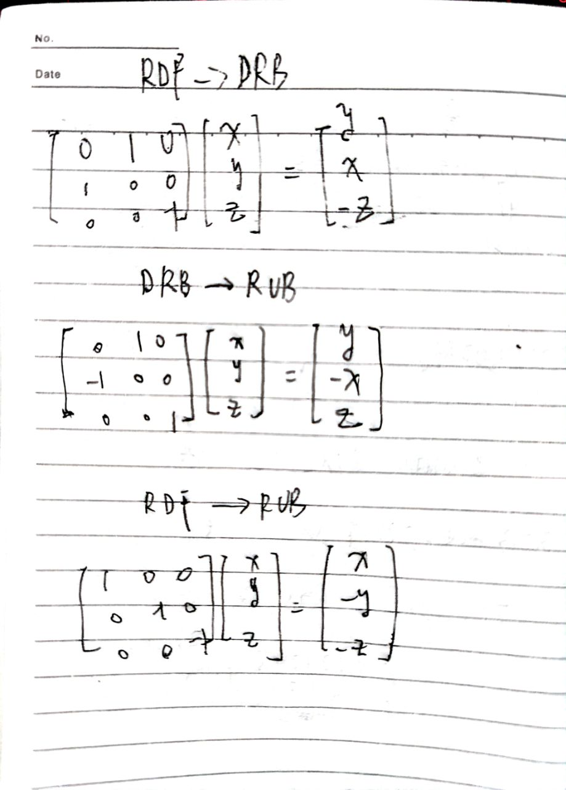
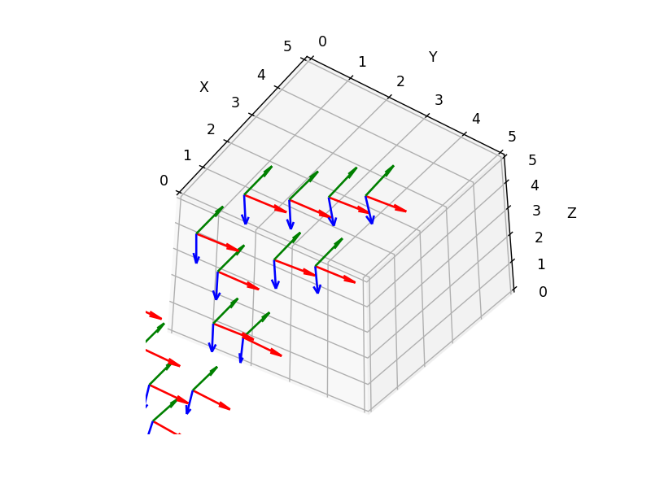
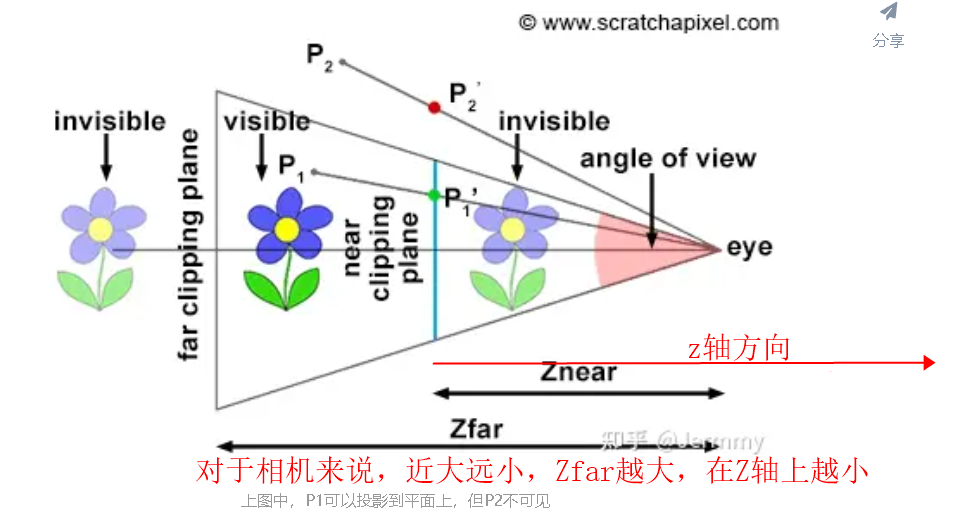
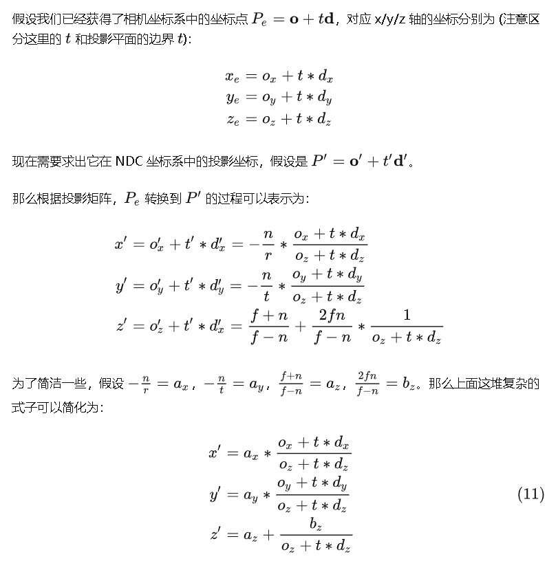
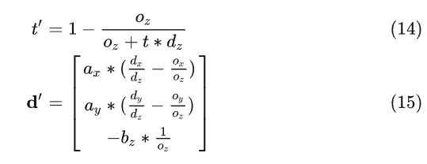

# 作业：坐标系转换

## 源码文件说明

坐标系转换代码：coords_transform.py

NeRF项目代码注释：load_llff.py,   run_nerf.py

在 NeRF 项目中，运用之前推导出的转换矩阵，将 LLFF 数据集中的外参数由 DRB 坐标系转换为 RUB 坐标系：详见下文 `NeRF项目中坐标系变换实践` 部分，代码改动涉及run_nerf.py中config_parser新增一个参数和load_llff.py中的load_llff_data函数。

相机位姿绘图：draw_pose.py


## 坐标系变换推导编程

推导：



编程：

```python

import numpy as np


def rdf2drb(xyz):
    transform_matrix = np.array([[0, 1, 0],
                                 [1, 0, 0],
                                 [0, 0, -1]])
    return transform_matrix @ xyz


def drb2rub(xyz):
    transform_matrix = np.array([[0, 1, 0],
                                 [-1, 0, 0],
                                 [0, 0, 1]])
    return transform_matrix @ xyz


def rdf2rub(xyz):
    transform_matrix = np.array([[1, 0, 0],
                                 [0, -1, 0],
                                 [0, 0, -1]])
    return transform_matrix @ xyz


if __name__ == "__main__":
    # each row is xyz of a point
    xyz = np.array([[1, 2, 3],
                    [4, 5, 6]])
    print(rdf2drb(xyz.T))
    """
    [[ 2  5]
     [ 1  4]
     [-3 -6]]
    """
```

## NeRF项目中坐标系变换实践

对原函数加了use_mat参数，当use_mat=True，表示使用旋转矩阵做坐标系变换：

```python
def load_llff_data(basedir, factor=8, recenter=True, bd_factor=.75, spherify=False, path_zflat=False, use_mat=False):
    poses, bds, imgs = _load_data(basedir, factor=factor) # factor=8 downsamples original imgs by 8x
    print('Loaded', basedir, bds.min(), bds.max())
    # Correct rotation matrix ordering and move variable dim to axis 0  把LLFF坐标系转换成NeRF坐标系的c2w矩阵
    if use_mat:
        drb2rub_matrix = np.array([[0, 1, 0],
                                   [-1, 0, 0],
                                   [0, 0, 1]])
        # 三列代表X,Y,Z轴在世界坐标系的方向，相当于三个点，转成NeRF坐标系
        poses[:, :3, :] = drb2rub_matrix @ poses[:, :3, :]
    else:
        poses = np.concatenate([poses[:, 1:2, :], -poses[:, 0:1, :], poses[:, 2:, :]], 1)
```

测试对比二者计算结果，可以看到一样：

```python
>> res2 = np.concatenate([poses[:, 1:2, :], -poses[:, 0:1, :], poses[:, 2:, :]], 1)
>> (drb2rub_matrix @ poses[:, :3, :]).shape
(3, 3, 20)
>> poses[:, :3, :] = drb2rub_matrix @ poses[:, :3, :]
>> np.allclose(poses, res2)  # 两种变换方式的结果对比
True
```

在参数解析部分加上use_mat参数，控制运行时使用的坐标系变换实现方法

```python
## llff flags
parser.add_argument("--use_mat", action='store_true', 
                        help='use matrix multiply to convert DRB to RUB coords, instead of swap axis.')
```

NeRF-pytorch原始实现的运行中的PSNR：

```bash
[TRAIN] Iter: 100 Loss: 0.05144716799259186 PSNR: 15.85673713684082                     
[TRAIN] Iter: 200 Loss: 0.04183351621031761 PSNR: 16.793371200561523                     
[TRAIN] Iter: 300 Loss: 0.034425169229507446 PSNR: 17.62369728088379                     
[TRAIN] Iter: 400 Loss: 0.029288947582244873 PSNR: 18.44193458557129                     
[TRAIN] Iter: 500 Loss: 0.027280736714601517 PSNR: 18.69952964782715                     
[TRAIN] Iter: 600 Loss: 0.026635045185685158 PSNR: 18.673259735107422                   
[TRAIN] Iter: 700 Loss: 0.024528972804546356 PSNR: 19.171321868896484
```

用旋转矩阵将 LLFF 数据集中的外参数由 DRB 坐标系转换为 RUB 坐标系：

```bash
[TRAIN] Iter: 100 Loss: 0.05023716390132904  PSNR: 15.845711708068848
[TRAIN] Iter: 200 Loss: 0.0419815331697464  PSNR: 16.708984375
[TRAIN] Iter: 300 Loss: 0.034054264426231384  PSNR: 17.471647262573242
[TRAIN] Iter: 400 Loss: 0.028970368206501007  PSNR: 18.31252098083496
[TRAIN] Iter: 500 Loss: 0.027194611728191376  PSNR: 18.602020263671875
[TRAIN] Iter: 600 Loss: 0.02690831944346428  PSNR: 18.628385543823242
[TRAIN] Iter: 700 Loss: 0.026227159425616264  PSNR: 18.863954544067383 
```

PSNR变化基本一致

## 外参数文件可视化

camera to world的矩阵如下，**旋转矩阵的第一列到第三列分别表示了相机坐标系的X, Y, Z轴在世界坐标系下对应的方向；平移向量表示的是相机原点在世界坐标系的对应位置**：


推导：

将c2w作用到(即左乘)相机坐标系下的X轴[1,0,0,0]，Y轴[0,1,0,0], Z轴[0,0,1,0]，以及原点[0,0,0,1]，会得到它们在世界坐标系的坐标表示：

```python3
[R, T][1, 0, 0, 0]^T = [r11, r21, r31]^T # X轴对应的是c2w矩阵的第一列
[R, T][0, 1, 0, 0]^T = [r12, r22, r32]^T # Y轴对应的是c2w矩阵的第二列
[R, T][0, 0, 1, 0]^T = [r13, r23, r33]^T # Y轴对应的是c2w矩阵的第三列
[R, T][0, 0, 0, 1]^T = [t1, t2, t3]^T    # 原点对应的是c2w矩阵的第四列
```

从上面可以看到可以看到，将c2w作用到相机坐标系下的X轴、Y轴、 Z轴、以及原点我们会依次得到c2w的四列向量。

相机位姿核心绘图函数：

```python
def draw_camera(ax, R, t):
    # 绘制相机坐标轴
    ax.quiver(t[0], t[1], t[2], R[0, 0], R[0, 1], R[0, 2], color='r', label='X')
    ax.quiver(t[0], t[1], t[2], R[1, 0], R[1, 1], R[1, 2], color='g', label='Y')
    ax.quiver(t[0], t[1], t[2], R[2, 0], R[2, 1], R[2, 2], color='b', label='Z')
```

绘图结果如下：



## LLFF 数据预处理的深入理解

参考[LLFF data preprocessing · Issue #34 · bmild/nerf (github.com)](https://github.com/bmild/nerf/issues/34)

### 为什么进行recenter_poses?

```python
def viewmatrix(z, up, pos):
    # 生成 R T矩阵
    vec2 = normalize(z)
    vec1_avg = up
    vec0 = normalize(np.cross(vec1_avg, vec2))  # z,y叉乘得到x
    vec1 = normalize(np.cross(vec2, vec0))  # x,z叉乘得到y，因为输入的up是计算得到的，不一定和Z轴垂直，所以修正一下up
    m = np.stack([vec0, vec1, vec2, pos], 1)  # 组成3*4的R T矩阵
    return m

def poses_avg(poses):
    hwf = poses[0, :3, -1:]

    center = poses[:, :3, 3].mean(0)  # 相机坐标系原点中心点
    vec2 = normalize(poses[:, :3, 2].sum(0))  # z轴单位向量
    up = poses[:, :3, 1].sum(0)  # y轴单位向量
    c2w = np.concatenate([viewmatrix(vec2, up, center), hwf], 1)  # 组成3*5矩阵
    
    return c2w
```

计算数据集位姿的平均平移（相机坐标系原点中心点），平均z轴，通过 Up x Z = X得到x轴，再通过 Z x X = Y修正up，得到一个平均的位姿矩阵。接着用平均位姿的逆矩阵左乘原始位姿（进行刚性变换。`poses = np.linalg.inv(c2w) @ poses`），以确保*相机位姿中旋转矩阵为单位矩阵，平移量为零向量。也就是变换后的平均相机位姿的位置处在世界坐标系的原点，XYZ轴朝向和世界坐标系的向一致。*

为什么计算中心位姿？NeRF训练需要，以及使用NDC坐标系时，假设场景已经中心化。


### 为什么进行bd_factor?

[nerf/load_llff.py](https://github.com/bmild/nerf/blob/8edde335d2b18188769850b03c45515352d66b31/load_llff.py#L257-L259)

Lines 257 to 259 in [8edde33](https://github.com/bmild/nerf/commit/8edde335d2b18188769850b03c45515352d66b31)

```python
# Rescale if bd_factor is provided
sc = 1. if bd_factor is None else 1./(bds.min() * bd_factor) 
poses[:,:3,3] *= sc 
bds *= sc 
```



如上图，NDC坐标系中，相机面向-z轴，并且在z=-near平面后面。near plane 到 far plane的部分会被归一化到【-1，1】。

进行bd_factor是因为后面NDC光线采样的时候，near平面固定为1,  为了保证bds里最小的near平面能大于1, 可以被后面ndc_rays采样时采样到。并且缩放后确保了near从1的附近开始，使得当原始near值大于1的时候，不会采样到1~near plane这部分。

```python
    if ndc:
        # for forward facing scenes
        rays_o, rays_d = ndc_rays(H, W, K[0][0], 1., rays_o, rays_d)
```

### NDC采样问题

NeRF中采样点表示为
$$
\bold o+t\bold d
$$


变换到NDC中：
$$
\bold o'+t'\bold d'
$$




从公式 (14) 可以看出，当 t=0 时，t'=0，当 t→∞ 时，t′→1。所以，在相机坐标系对光线进行采样 (t∈(0,∞))，就等价于在 NDC ray space 中，对 t′ 在 [0,1] 范围内进行采样。

